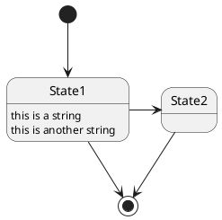

# 状態機械と仕様記述

## 1. 導入：状態機械とは何か

状態機械（State Machine）は、一定の規則に従って複数の内部「状態」の間を「遷移」する仮想的な機械であり、現在の状態と入力の組み合わせを規則の中から探し出し、指定された次の状態へ遷移する。状態機械は、システムの動的な振る舞いをモデル化するための強力な仕様記述手法である。

有限状態機械（Finite State Machine, FSM）または有限オートマトン（Finite Automaton）は、有限個の状態をもち、入力とそのときの状態に応じて出力を生成し次の状態に遷移する計算モデルである。

### 1.1 状態機械の歴史的背景

状態機械の形式は1980年代にDavid Harelによって発明されたステートチャート（Statecharts）により大きく進化した。Harelは、複雑な航空電子システムの設計を支援している際にこの図を発明した。ステートチャートは、従来のFSMに階層性、並行性、通信の概念を追加することで、状態図のより表現力豊かな形式を作り出した。

1990年代には、ステートチャートは統一モデリング言語（UML）仕様内の振る舞い図として採用された。UML状態機械は、Harelのステートチャートをオブジェクト指向に適応・拡張したものである。

### 1.2 状態機械の応用分野

状態機械は以下の分野で広く応用されている：

- **UI（ユーザーインターフェース）**：ボタン、フォーム、ダイアログの状態管理
- **ゲーム開発**：キャラクターの行動、ゲームの進行状態
- **プロセス制御**：製造ライン、ロボット制御
- **通信プロトコル**：ネットワークプロトコルの検証
- **ワークフロー**：ビジネスプロセス、承認フロー
- **論理回路設計**：デジタル回路の設計と検証
- **言語の構文解析**：コンパイラ、パーサーの実装
- **組み込みシステム**：デバイスの動作制御

## 2. 有限状態機械（FSM）の形式的定義

### 2.1 基本的な定義

有限状態機械（FSM）は、形式的には**5つ組**として定義される：

```
M = (Q, Σ, δ, q₀, F)
```

ここで：
- **Q**: 有限個の状態の集合
- **Σ**: 有限個の入力記号の集合（入力アルファベット）
- **δ**: 遷移関数 `δ: Q × Σ → Q`
- **q₀**: 初期状態（q₀ ∈ Q）
- **F**: 受理状態（最終状態）の集合（F ⊆ Q）

### 2.2 完全指定と不完全指定

**完全指定有限状態機械：**
入力と現状態のすべての組合せに対して出力と次状態が定義されている有限状態機械。

**不完全指定有限状態機械：**
一部の組合せに対して出力や次状態が定義されていない有限状態機械。

## 3. MealyマシンとMooreマシン

FSMには出力の生成方法によって2つの主要な種類がある。

### 3.1 Mealyマシン

**定義：**
Mealyマシンは、出力が**現在の状態と現在の入力の両方**によって決定される有限状態機械である。

**出力関数：**
```
λ: Q × Σ → Δ
```
（Qは状態、Σは入力アルファベット、Δは出力アルファベット）

**特徴：**
- 出力は**遷移に関連付けられる**
- 入力変化が論理処理完了次第すぐに出力変化を引き起こす可能性がある
- n個の入力に対してn個の出力を生成

**利点と課題：**
- より少ない状態で同じ機能を実装できる
- しかし、2つのマシンが相互接続されている場合、大きな問題となる可能性がある

### 3.2 Mooreマシン

**定義：**
Mooreマシンは、出力が**現在の状態のみ**に依存する有限状態機械である。

**出力関数：**
```
λ: Q → Δ
```

**特徴：**
- 出力は**状態に関連付けられる**
- 出力はクロックエッジで変化する（常に1サイクル後）
- n個の入力に対してn+1個の出力を生成

**安全性：**
Mooreマシンは、Mealyマシンよりも安全に使用できる。出力はクロックエッジで変化するため、タイミングの問題が発生しにくい。

### 3.3 比較表

| 特性 | Mealyマシン | Mooreマシン |
|------|------------|------------|
| 出力依存性 | 状態と入力 | 状態のみ |
| 出力タイミング | 入力変化時（即座） | クロックエッジ |
| 状態数 | 少ない | 多い |
| 出力数（n入力） | n個 | n+1個 |
| 安全性 | 低い（相互接続時） | 高い |
| 実用性 | 高速応答が必要な場合 | 安定性が必要な場合 |

## 4. 拡張有限状態機械（EFSM）

### 4.1 EFSMの概要

拡張有限状態機械（Extended Finite State Machine, EFSM）は、古典的な（Mealy）有限状態機械モデルを以下の要素で拡張したモデルである：

- **入力パラメータと出力パラメータ**
- **コンテキスト変数**（メモリ）
- **操作（更新関数）**
- **述語（ガード条件）**：コンテキスト変数と入力パラメータ上で定義

### 4.2 EFSMの形式的定義

決定性EFSMは以下のタプルで定義される：

```
EFSM = (Q, X, I, O, δ, λ, s₀, x₀)
```

ここで：
- **Q**: 有限個のモード（状態）の集合
- **X**: 型付き内部状態変数
- **I**: 入力変数
- **O**: 型付き出力変数
- **δ**: 遷移関数
- **λ**: 出力関数
- **s₀**: 開始モード
- **x₀**: 内部状態変数の初期値

### 4.3 ガード条件とアクション

**ガード条件（Guard Condition）：**
遷移が有効になるために、入力と内部状態について真でなければならないことを指定する。ガード条件は、EFSMの入力および内部状態変数にわたるブール述語を含むことができる。

**アクション（Action）：**
遷移が取られたときの出力および内部状態変数への代入を指定する。

### 4.4 EFSMの構成

マシンの構成（configuration）は、状態と（コンテキスト）変数の現在の評価値のベクトルからなる。

### 4.5 EFSMの利点

EFSMは、制御部分とデータ部分の両方をモデル化できる。変数（メモリ）のセットでFSM構造を拡張するためである。EFSMでは、遷移が入力とマシンの変数に対するガード（事前条件）を持つことができ、またこれらの変数への操作（代入）を持つことができる。

## 5. Harelのステートチャート（Statecharts）

### 5.1 ステートチャートの革新

Harelのステートチャートは、従来のFSMに対する最も重要な革新は、**階層的にネストされた状態**の導入である。ステートチャートは階層的状態機械（HSM）とも呼ばれる。

David Harelは、階層性、並行性、通信を状態図に追加することで、状態図のより表現力豊かな形式を作成した。

### 5.2 コアとなる3つの要素

ステートチャートは、従来の状態遷移図を本質的に以下の3つの要素で拡張する：

1. **階層（Hierarchy）**
2. **並行性（Concurrency）**
3. **通信（Communication）**

### 5.3 階層的分解（Hierarchical Decomposition）

システムがネストされた状態（サブステート）にある場合、それは暗黙的に周囲の状態（スーパーステート）にもある。

**動作原理：**
状態機械は、サブステートのコンテキストで任意のイベントを処理しようとするが、サブステートがイベントの処理方法を規定していない場合、イベントはスーパーステートのより高いレベルのコンテキストで自動的に処理される。

**メリット：**
階層性により、状態の再利用が可能になり、複雑なシステムの記述が簡潔になる。

### 5.4 直交領域（Orthogonal Regions）

UMLステートチャートは**AND分解**を導入している。つまり、複合状態は2つ以上の直交領域を含むことができ、そのような複合状態にあることは、すべての直交領域に同時にあることを意味する。

**並行状態（Parallel State）：**
複数の領域に分割された状態。各領域にはより多くのサブステートが含まれる。

**仮想並行性：**
直交領域は仮想的に並列で実行される。重要：直交状態は真の並列実行ではない。各実行サイクル中に、順次一つずつ評価される。

### 5.5 並行性による状態爆発の回避

並行状態は、機械が複数の離散的な振る舞いを同時に組み合わせる必要がある場合に使用される。

**劇的な複雑性の削減：**
並行状態なしでは、4つの独立したオン/オフスイッチのセットをモデル化するには、すべての可能な遷移をモデル化するために**16の原子状態と64の遷移**が必要になる。

並行状態を使用すると、同じ4つの独立したオン/オフスイッチのセットをモデル化するには、**わずか8つの状態と8つの遷移**のみが必要になる。

### 5.6 同期：フォークとジョイン

**フォーク（Fork）ノード：**
単一の遷移を複数の並列遷移に分割し、複数の領域を同時にアクティブにする。

**ジョイン（Join）ノード：**
複数の並列領域が特定の状態に到達するのを待ってから進行する。

フォークノードは実行を複数の並列パスに分割し、ジョインノードは進行する前に複数の並列パスを同期する。

## 6. UML状態機械

### 6.1 UMLへの統合

UML状態機械は、Harelのステートチャートをオブジェクト指向に適応・拡張したものである。ステートチャートの変種が統一モデリング言語（UML）の一部となって以来、広く普及している。

### 6.2 主要な機能

UML状態機械には以下の機能が含まれる：

- **階層的状態のネスト**
- **直交領域（並行性）**
- **エントリーアクションとイグジットアクション**
- **内部遷移**
- **履歴状態**：以前のサブステートを記憶
- **選択ポイント**：条件分岐
- **ジャンクションポイント**：複数の遷移の結合

### 6.3 UML状態図の要素

- **状態（State）**：角が丸い矩形で表現
- **遷移（Transition）**：矢印で表現、イベント、ガード条件、アクションを含む
- **初期状態（Initial State）**：黒丸で表現
- **最終状態（Final State）**：二重円で表現
- **複合状態（Composite State）**：サブ状態を含む状態
- **並行状態（Concurrent State）**：点線で分割された領域

## 7. 状態遷移表と状態遷移図

### 7.1 状態遷移図（State Transition Diagram）

状態遷移図は、システムやオブジェクトの状態変化を視覚的に表現する図である。

**利点：**
- ソフトウェアやシステムの全体像を俯瞰的にとらえることができる
- 各状態とイベントが線で結ばれているため、流れを把握できる
- 動的な振る舞いを直感的に理解しやすい
- 要件の漏れや不整合を早期に発見できる

**構成要素：**
- **状態（State）**：システムが取りうる条件や状況
- **イベント（Event）**：状態遷移のトリガー
- **遷移（Transition）**：ある状態から別の状態への移行
- **アクション（Action）**：遷移時に実行される処理

### 7.2 状態遷移表（State Transition Table）

状態遷移表は、各状態とイベントに対する遷移後の状態をマトリクスで表現する。

**利点：**
- 条件や組み合わせの**網羅性を検討**できる
- 考えられる全ての状態とイベントの組み合わせを記述するため、仕様の抜け漏れを防ぐ
- 論理的な矛盾や見落としを早期に発見できる
- チーム内でのレビューが容易
- 仕様の確認や修正がスムーズに行える

**形式：**

| 現在の状態 / イベント | イベント1 | イベント2 | イベント3 |
|---------------------|----------|----------|----------|
| 状態A | 状態B / アクション1 | 状態A | - |
| 状態B | 状態C | 状態A / アクション2 | 状態B |
| 状態C | 状態A | 状態B | 状態C / アクション3 |

### 7.3 状態遷移図と状態遷移表の使い分け

**状態遷移図が適している場合：**
- システムの概要を把握したい
- 流れやシーケンスを理解したい
- ステークホルダーへの説明に使用

**状態遷移表が適している場合：**
- 網羅性を確認したい
- 詳細な仕様を検討したい
- テストケースの作成に使用
- 複雑な条件を整理したい

**相補的な使用：**
両者は相補的であり、状態遷移図で全体像を把握し、状態遷移表で網羅性を確認するという併用が効果的である。

## 8. 状態機械による仕様記述の利点

### 8.1 明確性と曖昧性の排除

状態機械は、システムの動作を**明確かつ形式的**に記述する。各状態での振る舞い、遷移条件、アクションが明示的に定義されるため、自然言語仕様に比べて曖昧性が大幅に減少する。

### 8.2 視覚的表現

状態遷移図は、システムの動的な振る舞いを**視覚的に把握**できる。文章やフローチャートでは表現しにくい「状態の変化」をシンプルな形で表現でき、システムの動作を直感的に理解しやすくなる。

### 8.3 形式検証との親和性

状態機械は、形式検証手法（特にモデル検査）との親和性が高い。

**モデル検査との統合：**
- 時相論理（Temporal Logic）を用いて仕様を記述
- 状態空間の網羅的探索により、デッドロック、活性性違反などを検出
- 数百の状態を持つ状態機械でも数秒で検証可能

**形式検証の応用：**
時相論理は、システム設計の振る舞いを捉えるための仕様言語として使用され、モデル検査は設計精度を評価するための検証手法として選択されている。

### 8.4 テスト生成

状態機械からテストケースを自動生成できる。

**カバレッジ基準：**
- **状態カバレッジ**：すべての状態を訪問
- **遷移カバレッジ**：すべての遷移を実行
- **パスカバレッジ**：特定のパスを実行

### 8.5 コード生成

状態機械の仕様から実装コードを自動生成できる。

**コード生成ツール：**
- Yakindu Statechart Tools
- IBM Rational Rhapsody
- MATLAB/Simulink Stateflow
- XState（TypeScript/JavaScript）

### 8.6 要求の階層的な組織化

Harelのステートチャートにより、要求を階層的に組織化できる。複雑なシステムを管理可能な部分に分解し、段階的に詳細化できる。

### 8.7 並行性の明示的モデル化

直交領域により、システムの並行的な側面を明示的にモデル化できる。これは、従来のFSMでは困難であった。

## 9. 状態機械の限界と課題

### 9.1 状態爆発問題（State Explosion Problem）

**問題の本質：**
状態機械の広範な使用を妨げている主な問題は、非常に単純な例を超えると、状態機械がしばしば**大量の状態**を持ち、その多くが同一の遷移を持つことである。

**原因：**
状態と遷移の爆発として知られる現象により、従来のFSMの複雑性は、それが記述するシステムの複雑性よりもはるかに速く成長する傾向がある。状態機械に新しい側面を追加すると、モデル化する必要がある状態の数が倍増し、不均衡に多数の遷移が作成される。

**具体例：**
変数の集合のすべての可能な組み合わせを表すために必要な状態の数は、変数の集合のデカルト積である。システムの状態空間の量は、その状態（プロセス）のサイズとともに指数関数的に増加し、その結果、システムのメモリ容量を超える可能性がある。

**影響：**
- 複雑なシステムを構築する場合、状態機械の実装は最良の選択肢ではない
- 数百行の読めないコードに対処することになる可能性がある
- メンテナンスとサポートに問題が発生する可能性が高い

### 9.2 並行性とメモリのモデル化の難しさ

従来のFSMは、順次的な振る舞いのモデル化には優れているが、状態爆発問題のため、**並行性やメモリのモデル化には実用的ではない**。

### 9.3 保守性の問題

複雑な状態機械は、保守とデバッグをかなり問題にする。潜在的に1000行以上の非同期テキストログを分析する必要があり、問題の追跡に何時間もかかる「スパゲッティコード」になる可能性がある。

### 9.4 緩和技術

状態爆発問題は、状態機械モデリングにおける重大な課題であり、緩和技術には以下が含まれる：

- **階層的分解**：Harelのステートチャートで実現
- **並行性**：直交領域の使用
- **合成的モデリング**：システムをコンポーネントに分解

## 10. 実用ツール：XStateとその他

### 10.1 XState概要

XStateは、JavaScriptおよびTypeScriptアプリのための**状態管理とオーケストレーション**ソリューションである。依存関係がゼロで、フロントエンドおよびバックエンドのアプリケーションロジックに役立つ。

**公式サイト：** https://xstate.js.org/

### 10.2 XStateの主要機能

XStateは以下を使用して、複雑なロジックを予測可能で堅牢で視覚的な方法で処理する：
- **イベント駆動プログラミング**
- **状態機械**
- **ステートチャート**
- **アクターモデル**

**ステートチャート：**
ステートチャートは、状態を持つ反応型システムをモデル化するための形式主義であり、個々のコンポーネントから全体的なアプリケーションロジックまで、アプリケーションの振る舞いを宣言的に記述するのに役立つ。

### 10.3 XStateエコシステム

XStateには、コアの有限状態機械およびステートチャートライブラリと、フレームワーク固有のパッケージが含まれる：

- `@xstate/react`
- `@xstate/vue`
- `@xstate/svelte`
- `@xstate/solid`

**現在のバージョン：** 5.27.0（npmレジストリに1282の他のプロジェクトが使用）

### 10.4 基本的な使用例

簡単なトグルマシンの例：

```typescript
import { createMachine, createActor } from 'xstate';

const toggleMachine = createMachine({
  id: 'toggle',
  initial: 'inactive',
  states: {
    inactive: {
      on: { TOGGLE: 'active' }
    },
    active: {
      on: { TOGGLE: 'inactive' }
    }
  }
});

const actor = createActor(toggleMachine);
actor.subscribe(state => console.log(state.value));
actor.start(); // inactive
actor.send({ type: 'TOGGLE' }); // active
```

### 10.5 その他の実用ツール

#### **MATLAB/Simulink Stateflow**
- モデルベース設計での状態機械モデリング
- 組み込みシステムの設計と検証
- 自動コード生成

#### **IBM Rational Rhapsody**
- UML/SysMLベースのモデル駆動開発
- リアルタイム組み込みシステムの設計
- コード生成と形式検証

#### **Yakindu Statechart Tools**
- Eclipse IDEベースのステートチャートモデリング
- C、C++、Java、Pythonへのコード生成
- シミュレーションとテスト

#### **Qt State Machine Framework**
- Qtアプリケーションのための状態機械フレームワーク
- 階層的状態機械のサポート
- 並行状態のサポート

## 11. 形式検証とモデル検査

### 11.1 モデル検査の概要

モデル検査は、ユーザーがシステムのモデルと望ましい特性を記述する論理式を生成し、モデル検査アルゴリズムがモデルが式を満たすかどうかをチェックする自動検証技術である。

**基本概念：**
形式検証は、有限状態並行システムが、（命題、分岐時間）時相論理で表現された仕様を満たすことを検証することを含む。トレースは状態の無限シーケンスであり、有限状態機械の意味論はトレースの集合である。

### 11.2 時相論理

モデル検査で使用される時相論理には、2つの主要なカテゴリがある：

**線形時間論理（LTL: Linear Time Logic）：**
時間的シーケンスの論理。

**分岐時間論理：**
CTL（Computation Tree Logic）などの論理を含み、異なる可能な実行パスを考慮する特性を表現するために使用される。

時相安全性（Temporal Safety）と活性（Liveness）特性が、モデル検査における重要な考慮事項である。

### 11.3 アルゴリズムの効率

モデル検査アルゴリズムは、仕様のサイズと並行システムのグローバル状態グラフのサイズの両方において線形の複雑性を持つ。数百の状態を持つ状態機械は、数秒でチェックできる。

### 11.4 UML状態機械からモデル検査へ

UML状態機械からモデル検査ツールの入力言語（PROMELAなど）への自動変換が開発されている。階層オートマトンを入力として受け取り、PROMELAモデルを出力として生成する。

### 11.5 形式検証の応用

**適用例：**
- **デッドロック検出**：システムが行き詰まり状態に陥らないことを保証
- **活性性検証**：システムが最終的に目標状態に到達することを保証
- **安全性検証**：システムが望ましくない状態に到達しないことを保証
- **プロトコル検証**：通信プロトコルが仕様を満たすことを検証

## 12. 状態機械設計パターン

### 12.1 Stateデザインパターン

**概要：**
Stateパターンは、オブジェクトがその内部状態を変更したときに振る舞いを変更できるようにする振る舞い的ソフトウェアデザインパターンである。このパターンは、有限状態機械の概念に近い。

**コアアイデア：**
任意の瞬間に、プログラムが取りうる状態の数は有限である。任意の一意の状態内で、プログラムは異なる振る舞いをし、プログラムはある状態から別の状態へ瞬時に切り替えることができる。

### 12.2 Stateパターンの構造

Stateパターンは、可能なすべてのオブジェクトの状態に対して新しいクラスを作成し、すべての状態固有の振る舞いをこれらのクラスに抽出することを提案する。

**コンテキストオブジェクト：**
元のオブジェクト（コンテキストと呼ばれる）は、すべての振る舞いを自分で実装するのではなく、現在の状態を表す状態オブジェクトの1つへの参照を格納し、すべての状態関連の作業をそのオブジェクトに委譲する。

### 12.3 主な利点

**明確な責任分離：**
各状態クラスが独自の振る舞いを定義し、複雑なロジックを簡素化する。

**再利用性：**
状態クラスは異なる実装間で再利用でき、重複を削減する。

**拡張性：**
新しい状態や変更を、他の部分に影響を与えることなく追加でき、システムを拡張・維持しやすくする。

### 12.4 実世界の応用

**自動販売機：**
自動販売機は、サービス準備完了、商品選択待ち、支払い処理、在庫切れ処理などの異なる状態を管理する必要がある。

**その他の例：**
- メディアプレーヤー（再生中、一時停止、停止）
- ドキュメント管理システム（ドラフト、レビュー中、承認済み）
- Eコマース注文システム（カート、注文済み、発送済み、配達済み）

### 12.5 状態遷移マトリクス（STM）

現代的な実装アプローチは、状態遷移を実装ロジックから分離することに焦点を当てている。関係は、状態遷移マトリクス（STM）と呼ばれるテーブルを使用して捕捉される。

**STMのエントリ形式：**
```
[現在の状態, イベント, 宛先状態]
```

**サンプルエントリ：**
```
{stateIdle, EVT_BUTTON_PRESSED, stateCrushBean}
```

この行は、現在の状態が'stateIdle'で、'EVT_BUTTON_PRESSED'が発生した場合、'stateCrushBean'に移動することを意味する。

## 13. 組み込みシステムにおける状態機械

### 13.1 組み込みシステムでの重要性

組み込みシステムにおいて、状態機械は最も一般的な設計手法の一つである。

**適用例：**
- **ロボット制御**：複雑な動きをさせるときに状態機械を定義
- **デバイス制御**：家電製品、IoTデバイスの動作制御
- **通信プロトコル**：シリアル通信、ネットワークプロトコルの実装
- **ユーザーインターフェース**：ボタン、LED、ディスプレイの状態管理

### 13.2 リアルタイム制約

組み込みシステムでは、リアルタイム制約が重要である。

**考慮事項：**
- 状態遷移の応答時間
- イベント処理の優先度
- 割り込み処理との統合
- メモリフットプリントの最小化

### 13.3 階層的状態機械（HSM）の利点

組み込みシステムにおいて、階層的状態機械（HSM）は特に有用である。

**Barr Groupのガイダンス：**
階層的状態機械（HSM）は、複雑な組み込みシステムの設計において重要なツールである。従来のフラットなFSMと比較して、以下の利点がある：

- **コードの削減**：共通の振る舞いをスーパーステートで定義
- **保守性の向上**：階層構造により理解しやすい
- **再利用性の向上**：スーパーステートを複数のコンテキストで再利用

### 13.4 実装技術

**switch-case実装：**
```c
switch (current_state) {
    case STATE_IDLE:
        if (event == EVT_START) {
            current_state = STATE_RUNNING;
        }
        break;
    case STATE_RUNNING:
        if (event == EVT_STOP) {
            current_state = STATE_IDLE;
        }
        break;
}
```

**関数ポインタテーブル実装：**
より柔軟で拡張可能な実装。

## 14. 状態機械の仕様記述言語

### 14.1 SCXML（State Chart XML）

SCXMLは、W3Cが標準化した状態機械の仕様記述言語である。

**特徴：**
- XML形式による状態機械の記述
- 階層的状態、並行状態のサポート
- データモデルの統合
- スクリプティングのサポート

### 14.2 SMCat

SMCatは、状態機械を記述するためのテキストベースの言語である。

**特徴：**
- 簡潔な構文
- 状態遷移図の自動生成
- 多様な出力形式（SVG、JSON、SMCatなど）

### 14.3 PlantUML State Diagram

PlantUMLは、テキストから図を生成するツールで、状態図もサポートしている。

**例：**


## 15. 状態機械と他の仕様記述手法の比較

### 15.1 状態機械 vs フローチャート

| 特性 | 状態機械 | フローチャート |
|------|---------|--------------|
| 焦点 | 状態と遷移 | 処理の流れ |
| 表現対象 | 動的な振る舞い | アルゴリズム |
| 並行性 | サポート（直交領域） | サポートしない |
| 階層性 | サポート（ステートチャート） | 限定的 |
| 適用分野 | リアクティブシステム | 手続き的処理 |

### 15.2 状態機械 vs ペトリネット

| 特性 | 状態機械 | ペトリネット |
|------|---------|------------|
| 並行性 | 直交領域で表現 | ネイティブにサポート |
| 資源管理 | 明示的でない | トークンで表現 |
| 可読性 | 高い | 中程度 |
| 形式検証 | 可能 | 豊富な解析技法 |
| 学習曲線 | 緩やか | やや急 |

### 15.3 状態機械 vs プロセス代数

| 特性 | 状態機械 | プロセス代数（CSP/CCS） |
|------|---------|----------------------|
| 形式性 | 中〜高 | 高 |
| 合成性 | 直交領域 | 代数的演算子 |
| 並行性 | サポート | 中心概念 |
| ツールサポート | 豊富 | 専門的 |
| 実用性 | 高い | 理論的 |

## 16. ケーススタディ：実世界での応用

### 16.1 通信プロトコル：TCP

TCPプロトコルは、複雑な状態機械として記述される。

**主要な状態：**
- CLOSED
- LISTEN
- SYN-SENT
- SYN-RECEIVED
- ESTABLISHED
- FIN-WAIT-1
- FIN-WAIT-2
- CLOSE-WAIT
- CLOSING
- LAST-ACK
- TIME-WAIT

**検証：**
TCPの状態機械は、形式手法を用いて検証されている。デッドロック、活性性、正しい接続確立と切断が検証される。

### 16.2 組み込みシステム：自動販売機

自動販売機は、状態機械の古典的な例である。

**状態：**
- アイドル
- 商品選択待ち
- 支払い待ち
- 商品提供中
- 釣銭返却中
- メンテナンス

**イベント：**
- 硬貨投入
- 商品選択ボタン押下
- キャンセルボタン押下
- 商品在庫なし

### 16.3 ユーザーインターフェース：メディアプレーヤー

メディアプレーヤーの状態機械：

**状態：**
- 停止
- 再生中
- 一時停止
- 早送り
- 巻き戻し

**遷移とアクション：**
- 停止 → 再生中：再生ボタン押下 / 再生開始
- 再生中 → 一時停止：一時停止ボタン押下 / 再生停止
- 一時停止 → 再生中：再生ボタン押下 / 再生再開

## 17. 状態機械の今後の展望

### 17.1 AI/機械学習との統合

状態機械とAI/機械学習の統合が進んでいる。

**適用例：**
- **強化学習**：状態と行動の関係を学習
- **異常検出**：正常な状態遷移パターンからの逸脱を検出
- **適応的状態機械**：実行時に状態遷移を学習・調整

### 17.2 分散システムへの適用

マイクロサービスアーキテクチャにおいて、サービス間の相互作用を状態機械でモデル化する試みが増えている。

**Sagaパターン：**
分散トランザクションを状態機械として表現し、補償アクションを定義する。

### 17.3 モデル駆動開発の進化

状態機械を中心としたモデル駆動開発が進化している。

**自動コード生成の高度化：**
- より効率的なコード生成
- 複数のプラットフォームへの対応
- テストコードの自動生成

### 17.4 形式検証ツールの進化

**2024年の動向：**
- より大規模な状態空間の検証
- 抽象解釈との組み合わせ
- SMTソルバーの活用
- AIを活用した検証の効率化

## 18. まとめと提言

### 18.1 状態機械の本質的価値

状態機械は、システムの動的な振る舞いを明確かつ形式的に記述するための強力な手法である。以下の特性により、仕様記述において不可欠なツールとなっている：

1. **明確性**：状態、遷移、イベントが明示的に定義される
2. **視覚性**：状態遷移図による直感的な理解
3. **形式性**：数学的に定義され、形式検証が可能
4. **階層性**：Harelのステートチャートによる複雑性の管理
5. **並行性**：直交領域による並行的振る舞いの表現
6. **実用性**：多様なツールとコード生成のサポート

### 18.2 適切な適用範囲

**状態機械が効果的な場合：**
- リアクティブシステム（イベント駆動）
- ユーザーインターフェース
- 通信プロトコル
- 組み込みシステムの制御
- ワークフローとビジネスプロセス
- 比較的少数の状態（数十〜数百）

**状態機械が困難な場合：**
- 大規模な状態空間（状態爆発）
- データ中心の処理（計算集約的なアルゴリズム）
- 複雑なデータ変換
- 純粋に手続き的な処理

### 18.3 状態爆発問題への対処

状態爆発問題は、状態機械の主要な限界であるが、以下の技術で緩和できる：

1. **階層的分解**：Harelのステートチャート
2. **直交領域**：並行的側面の分離
3. **拡張FSM（EFSM）**：変数とガード条件の使用
4. **合成的モデリング**：システムのモジュール分割

### 18.4 実務への推奨事項

**設計段階：**
- 要求分析時に状態機械による仕様記述を検討
- 状態遷移図と状態遷移表を併用し、視覚性と網羅性を両立
- 階層的状態機械を活用し、複雑性を管理

**実装段階：**
- XStateなどの成熟したライブラリを活用
- 状態機械からのコード自動生成を検討
- テストケースを状態機械から導出

**検証段階：**
- モデル検査ツールによる形式検証
- 時相論理による特性の記述と検証
- シミュレーションによる動作確認

**保守段階：**
- 状態機械を仕様のドキュメントとして維持
- 変更時には状態機械を更新し、整合性を保つ
- 状態遷移のトレーシングとログ解析

### 18.5 今後の方向性

1. **AI統合の深化**：適応的状態機械、異常検出
2. **分散システムへの拡張**：マイクロサービス、Sagaパターン
3. **形式検証の高度化**：より大規模な状態空間の扱い
4. **ツールの進化**：より直感的なモデリング、効率的なコード生成

### 18.6 最終的な結論

状態機械は、半世紀以上にわたって進化し続けてきた仕様記述手法であり、その基本概念は今なお有効である。有限状態機械からHarelのステートチャート、UML状態機械、そして現代のXStateのようなライブラリに至るまで、状態機械は常に実用性を維持してきた。

状態爆発問題という本質的な限界が存在するものの、階層性と並行性の導入により、この問題は大幅に緩和されている。形式検証との親和性の高さ、視覚的な表現力、そして自動コード生成のサポートにより、状態機械は今後も仕様記述の重要なツールであり続けるであろう。

---

## 参考文献・情報源

### 有限状態機械の基礎
- [Finite-state machine - Wikipedia](https://en.wikipedia.org/wiki/Finite-state_machine)
- [有限オートマトン - Wikipedia](https://ja.wikipedia.org/wiki/%E6%9C%89%E9%99%90%E3%82%AA%E3%83%BC%E3%83%88%E3%83%9E%E3%83%88%E3%83%B3)
- [Finite-State Machine Overview - Emergent Mind](https://www.emergentmind.com/topics/finite-state-machine-fsm)
- [Finite State Machine (FSM): A Comprehensive Guide - 2024](https://www.siliconveda.com/2024/10/finite-state-machine-fsm-comprehensive.html)
- [有限状態機械とは - 情報試験対策室](https://joho-taisaku.com/finite-state-machine/)

### 要求工学とFSM
- [A Finite State Machine Model for Requirements Engineering](https://re-magazine.ireb.org/articles/a-finite-state-machine-model)
- [FORMAL VERIFICATION OF FINITE STATE MACHINES - Academia.edu](https://www.academia.edu/3671180/FORMAL_VERIFICATION_OF_FINITE_STATE_MACHINES)

### MealyマシンとMooreマシン
- [Moore and Mealy Machines - Tutorialspoint](https://www.tutorialspoint.com/automata_theory/moore_and_mealy_machines.htm)
- [Moore machine - Wikipedia](https://en.wikipedia.org/wiki/Moore_machine)
- [Mealy machine - Wikipedia](https://en.wikipedia.org/wiki/Mealy_machine)
- [Mealy and Moore Machines in TOC - GeeksforGeeks](https://www.geeksforgeeks.org/theory-of-computation/mealy-and-moore-machines-in-toc/)
- [Overview of Mealy and Moore Machines - MATLAB](https://www.mathworks.com/help/stateflow/ug/overview-of-mealy-and-moore-machines.html)

### 拡張有限状態機械（EFSM）
- [Extended finite-state machine - Wikipedia](https://en.wikipedia.org/wiki/Extended_finite-state_machine)
- [Code Generation from Extended Finite State Machines - UPENN](https://www.seas.upenn.edu/~lee/10cis541/lecs/EFSM-Code-Generation-v4-1x2.pdf)
- [The Extended Finite State Machine Model - ACM](https://dl.acm.org/doi/pdf/10.1145/157485.164585)
- [GitHub - EFSM-tools](https://github.com/ulyantsev/EFSM-tools)

### Harelのステートチャート
- [UML state machine - Wikipedia](https://en.wikipedia.org/wiki/UML_state_machine)
- [Introduction to Hierarchical State Machines - Barr Group](https://barrgroup.com/blog/introduction-hierarchical-state-machines)
- [Hierarchical State Machines - UPenn](https://www.cis.upenn.edu/~lee/06cse480/lec-HSM.pdf)
- [Statecharts: a visual formalism for complex systems - ScienceDirect](https://www.sciencedirect.com/science/article/pii/0167642387900359)
- [A Crash Course in UML State Machines](https://www.state-machine.com/doc/AN_Crash_Course_in_UML_State_Machines.pdf)
- [Hierarchical State Machines - State Machine](https://www.state-machine.com/doc/Hierarchical_State_Machines.pdf)

### 並行状態と直交領域
- [Orthogonal States - Statecharts Online](https://statecharts.online/chapters/05-orthogonal-states.html)
- [Parallel State - Statecharts Glossary](https://statecharts.dev/glossary/parallel-state.html)
- [Orthogonal Regions - NI LabVIEW](https://www.ni.com/docs/en-US/bundle/labview-statechart-module/page/lvscconcepts/sc_c_orthogonal.html)
- [Orthogonal Regions - StaMa](https://stama-statemachine.github.io/StaMa/html/7e6981a4-284a-4027-9e21-50d195fe0169.htm)

### 状態遷移表と状態遷移図
- [状態遷移図をわかりやすく - VALTES](https://service.valtes.co.jp/s-test/blog/statetransitiondiagram_vol44/)
- [状態遷移図とは - SHIFT](https://service.shiftinc.jp/column/4960/)
- [状態遷移表による設計について - ソフテック](https://www.softech.co.jp/mm_140108_firm.htm)
- [ステートマシン図とは - ネットアテスト](https://www.netattest.com/state-machine-diagram-2024_mkt_tst)
- [UML ステートマシン図 - SINT](https://products.sint.co.jp/ober/blog/statemachinediagram)
- [ステートマシン図と状態遷移表 - Enterprise Architect](https://www.sparxsystems.jp/products/EA/tech/StateMachine.htm)

### 状態爆発問題
- [State Machine: State Explosion - Statecharts](https://statecharts.dev/state-machine-state-explosion.html)
- [Model Checking and the State Explosion Problem](https://pzuliani.github.io/papers/LASER2011-Model-Checking.pdf)
- [Why Developers Never Use State Machines](https://workflowengine.io/blog/why-developers-never-use-state-machines/)

### 形式検証とモデル検査
- [Formal Verification by Model Checking - CMU](https://www.cs.cmu.edu/~aldrich/courses/413/slides/28-model-checking.pdf)
- [Automatic verification of finite-state concurrent systems - ACM](https://dl.acm.org/doi/10.1145/5397.5399)
- [Formalizing UML State Machines for Automated Verification - arXiv](https://arxiv.org/pdf/2407.17215)
- [Formalization of UML state machines using temporal logic - Academia](https://www.academia.edu/123008706/Formalization_of_UML_state_machines_using_temporal_logic)

### XStateと実用ツール
- [XState - JavaScript State Machines and Statecharts](https://xstate.js.org/)
- [Stately + XState docs](https://stately.ai/docs)
- [GitHub - statelyai/xstate](https://github.com/statelyai/xstate)
- [xstate - npm](https://www.npmjs.com/package/xstate)
- [An Introduction to XState in TypeScript - Medium](https://medium.com/@n.khosla91/an-introduction-to-xstate-in-typescript-e71c7729ce88)

### Stateデザインパターン
- [State Design Pattern - GeeksforGeeks](https://www.geeksforgeeks.org/system-design/state-design-pattern/)
- [State pattern - Wikipedia](https://en.wikipedia.org/wiki/State_pattern)
- [State - Refactoring Guru](https://refactoring.guru/design-patterns/state)
- [State Design Pattern - SourceMaking](https://sourcemaking.com/design_patterns/state)
- [Efficient State Machine Design Pattern - Medium](https://medium.com/@dheeptuck/efficient-state-machine-design-pattern-d9b1347455cd)

### 日本語資料
- [有限状態機械 - 電子情報通信学会](https://www.ieice-hbkb.org/files/01/01gun_08hen_03.pdf)
- [オートマトン - IT用語辞典 e-Words](https://e-words.jp/w/%E3%82%AA%E3%83%BC%E3%83%88%E3%83%9E%E3%83%88%E3%83%B3.html)
- [ステートマシンと状態遷移図 - Zenn](https://zenn.dev/susiyaki/books/379ad159248627/viewer/what-is-state-machines-and-statecharts)
- [State Machines - 金城大学](https://www.kinjo-u.ac.jp/ushida/tekkotsu/12_State/index.html)

---

**調査実施日**: 2026-02-14
**調査者**: researcher-11
